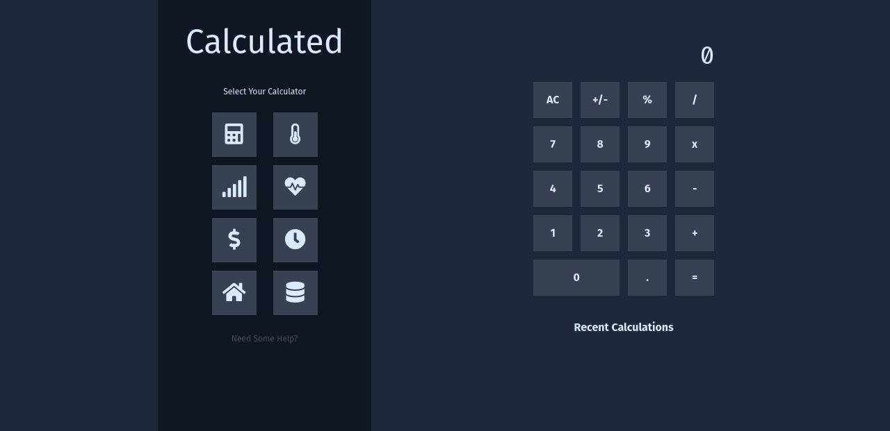

### About
#### A calculator with using creat-react-app, redux, tailwincss, and font-awesome.

### Deployed in Vercel.
[https://calculator-psi-ten.vercel.app](https://calculator-psi-ten.vercel.app/)

Improvements (TODOs):
- Should disallow 1+*3
- Should allow 03 + 4
